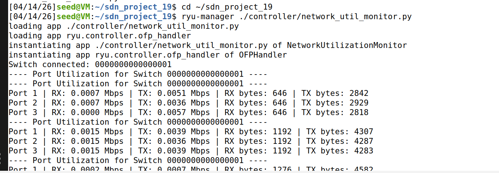
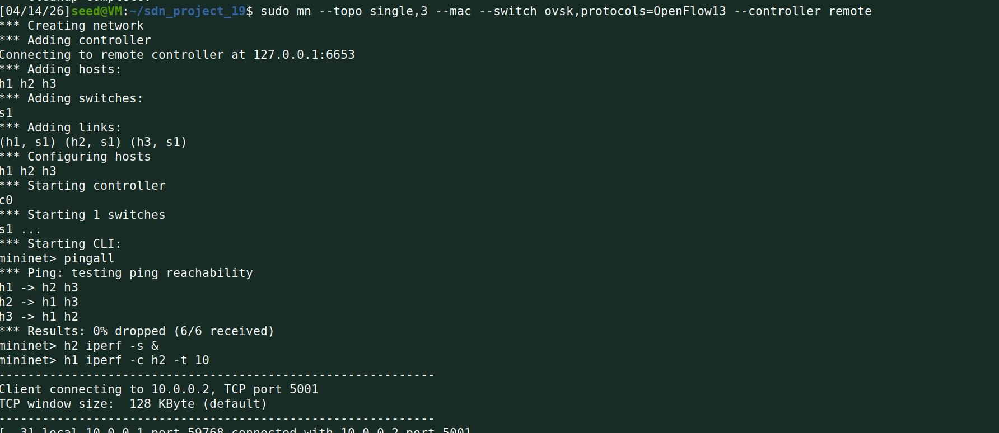
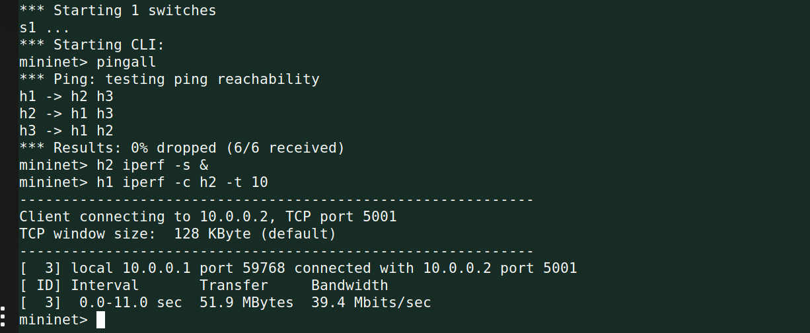
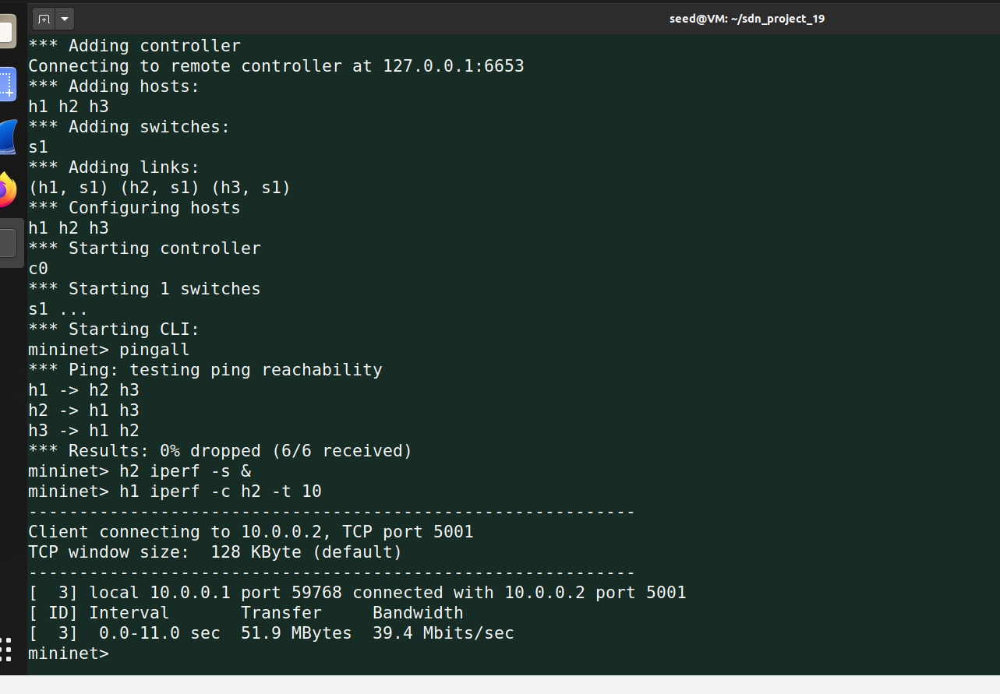
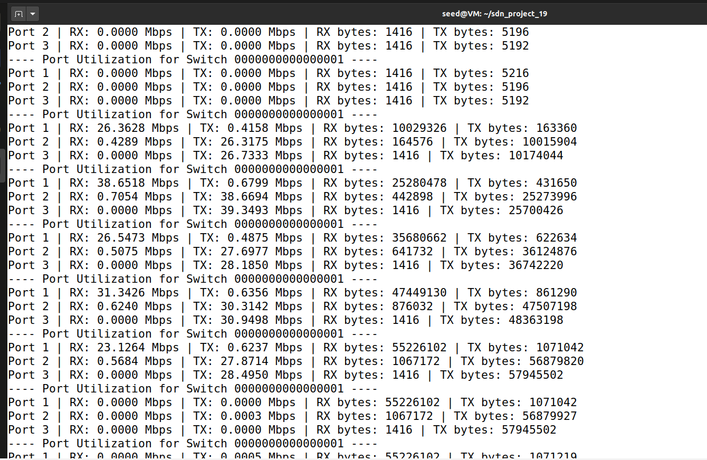
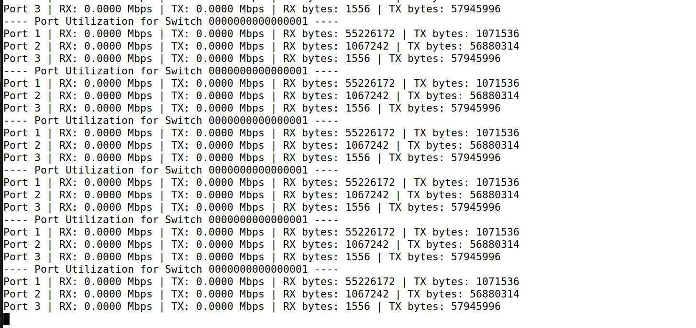

# SDN Project 19: Network Utilization Monitor

## Student Details
- Name: **Shishir Hegde**
- SRN: **PES1UG24CS438**
- Class: **H Section**

## Project Overview
This project implements a **Ryu SDN controller application** that monitors switch port utilization in real time.

The controller:
- Connects to OpenFlow 1.3 switches
- Periodically requests port statistics
- Calculates RX/TX throughput (Mbps) using byte deltas
- Prints per-port utilization logs in the controller console

## Project Structure
```text
sdn_project_19/
|-- controller/
|   |-- network_util_monitor.py
|-- docs/
|   `-- screenshots/
|       |-- 01_ryu_controller_start.png
|       |-- 02_mininet_launch_and_commands.png
|       |-- 03_iperf_result.png
|       |-- 04_mininet_cli_full.png
|       |-- 05_controller_port_utilization.png
|       `-- 06_controller_continuous_output.png
|-- logs/
|   |-- controller_output.txt
`-- README.md
```

## Prerequisites (Linux)
Recommended: Ubuntu 20.04+ (or Mininet VM)

Install required packages:

```bash
sudo apt update
sudo apt install -y python3 python3-pip mininet openvswitch-switch
python3 -m pip install --upgrade pip
python3 -m pip install ryu
```

## Demonstration Commands (Exactly as Used)
These are the exact commands used in your screenshots:

```bash
cd ~/sdn_project_19
ryu-manager ./controller/network_util_monitor.py
sudo mn --topo single,3 --mac --switch ovsk,protocols=OpenFlow13 --controller remote
pingall
h2 iperf -s &
h1 iperf -c h2 -t 10
```

## Execution Steps with Screenshots

### 1. Start Ryu Controller (Terminal 1)
```bash
cd ~/sdn_project_19
ryu-manager ./controller/network_util_monitor.py
```

*Figure 1: Controller startup and switch connection logs.*

### 2. Launch Mininet Topology (Terminal 2)
```bash
sudo mn --topo single,3 --mac --switch ovsk,protocols=OpenFlow13 --controller remote
```

*Figure 2: Mininet network creation and CLI execution.*

### 3. Run Connectivity and Bandwidth Tests (Mininet CLI)
```bash
pingall
h2 iperf -s &
h1 iperf -c h2 -t 10
```

*Figure 3: `iperf` throughput result in Mininet.*


*Figure 4: Full CLI sequence including `pingall` and `iperf` commands.*

## Expected Output
In Terminal 1 (controller), logs will look like:
- `Switch connected: ...`
- `---- Port Utilization for Switch ... ----`
- `Port X | RX: <value> Mbps | TX: <value> Mbps | ...`


*Figure 5: Port utilization values (RX/TX in Mbps and bytes).*


*Figure 6: Continuous polling output from the Ryu controller.*

Sample output is available in:
- `logs/controller_output.txt`

## Optional Cleanup
```bash
exit
sudo mn -c
```
